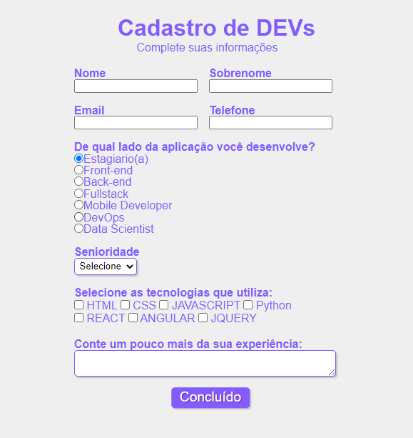

 #   Projeto: Formulario Devs

## Descrição:
Exercícios prático, criação de um formulário Devs (Aula prática: Rafaella Ballerini). Uso do HTML5 e CSS3. Neste repositório, constam as imagens do projeto original, imagens do projeto modificado (feito por mim e custumizado). Constam também os arquivos HTML5 e CSS3.

[🔗 Clique aqui para acessar o site Formulario Devs](https://marcos-franco.github.io/formularioDevs/)

## 🛠 Tecnologias:
- HTML
- CSS
- Git
- Github

## Status do Projeto:
100% Concluído

## Autor:
Projeto desenvolvido por [Marcos Franco](https://www.linkedin.com/in/marcosfranco-5b1a8a111/)

## 💛 Contatos:

Linkedin: https://www.linkedin.com/in/marcosfranco-5b1a8a111/

Repositório Github: https://github.com/marcos-franco

WhatSapp: https://contate.me/marcos-franco

E-mail: masf68@hotmail.com
